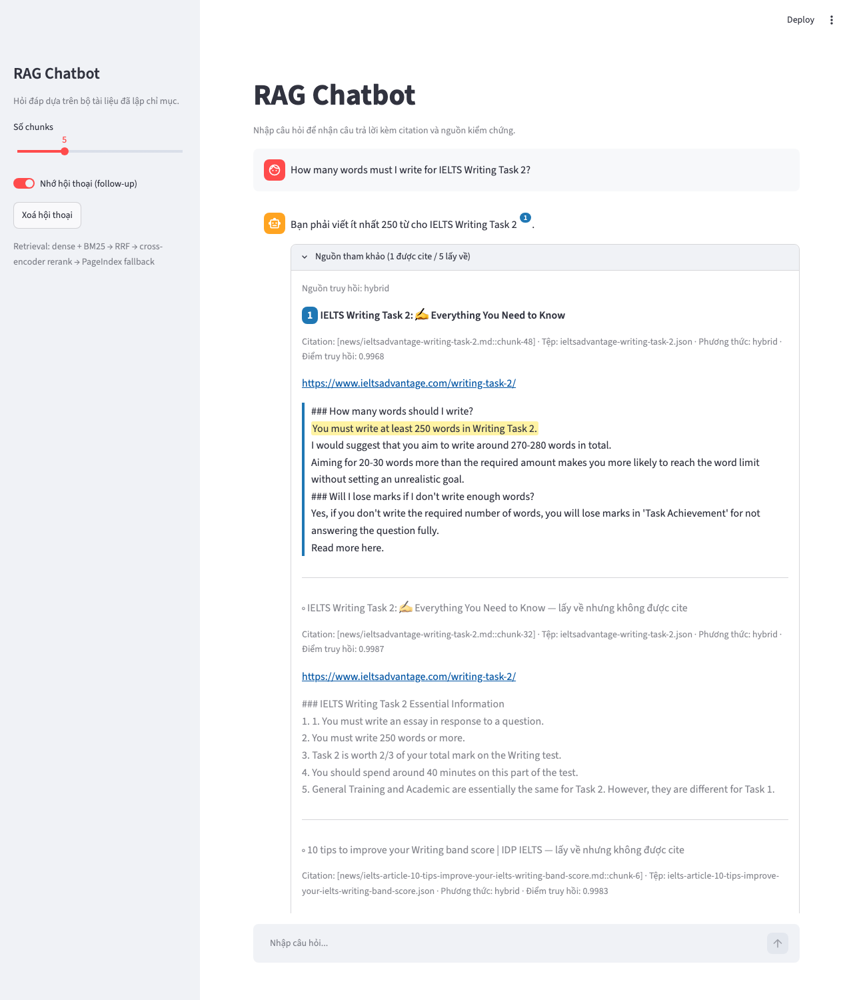
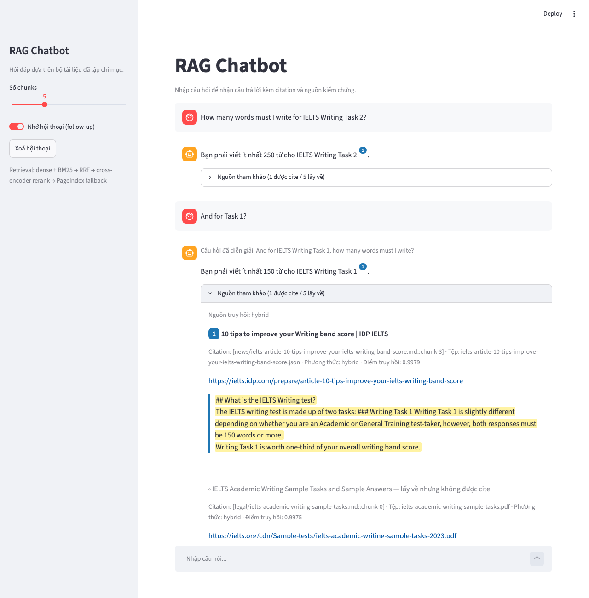

# K4-DAY08-DuoH — RAG Chatbot về IELTS Writing

Chatbot hỏi đáp về **IELTS Writing** (band descriptors, tiêu chí chấm điểm, yêu cầu đề bài, bài mẫu và lời khuyên) dựa trên tài liệu chính thức của ielts.org và các trang luyện thi uy tín. Pipeline: convert → chunk → index → HyDE (bonus) → dense + BM25 → RRF → cross-encoder rerank (bonus) → fallback → generation có citation, kèm giao diện Streamlit và báo cáo đánh giá 4 metric.

## Thành viên

| Họ tên | Mã học viên | Phần việc chính | Báo cáo cá nhân |
| --- | --- | --- | --- |
| Lê Chí Hùng | 2A202602863 | Task 2, 6, 7, 8, 9, 12 (reranker), 13 (memory), 14 (HyDE), golden dataset, Task 11, `RESULT.md` | [reports/2A202602863-LeChiHung.md](reports/2A202602863-LeChiHung.md) |
| Nguyễn Văn Hưởng | 2A202602743 | Task 1, 3, 4, 5, 10, Streamlit UI, test Task 5/10 | [reports/2A202602743-NguyenVanHuong.md](reports/2A202602743-NguyenVanHuong.md) |

## Dữ liệu

- **5 tài liệu chính sách** (`data/landing/legal/`): PDF chính thức tải từ CDN ielts.org — Writing Band Descriptors, Key Assessment Criteria, Guide to IELTS Scores, Academic/General Training Writing Sample Tasks. Nguồn ghi trong `data/landing/legal/sources.json`.
- **10 bài viết** (`data/landing/news/`): crawl bằng Crawl4AI từ ielts.org, IDP IELTS, IELTS Liz, IELTS Advantage, TED IELTS, IELTS Tutors, Cathoven. Mỗi JSON có `url`, `title`, `date_crawled`, `content_markdown`.
- **Markdown chuẩn hoá** (`data/standardized/{legal,news}/`): front matter `source/title/doc_type/url`. PDF band descriptors là bảng 4 cột không viền nên được parse theo toạ độ bằng pdfplumber; các PDF còn lại dùng MarkItDown.
- Index: 985 chunks (Recursive 500/50), embedding `BAAI/bge-m3`, ChromaDB cosine.

## Kiến trúc

| Bước | Module | Ghi chú |
| --- | --- | --- |
| Thu thập | `task1_collect_legal_docs`, `task2_crawl_news` | requests + Crawl4AI |
| Chuẩn hoá | `task3_convert_markdown` | pdfplumber / MarkItDown |
| Chunk & index | `task4_chunking_indexing` | bge-m3, ChromaDB cosine, ID `doc_type/file.md::chunk-N` |
| Dense search | `task5_semantic_search` | cosine similarity, `retrieval_method="dense"` |
| BM25 | `task6_lexical_search` | BM25Okapi trên cùng corpus chunks, unigram + bigram |
| RRF | `task7_reranking` | k = 60, chạy đúng một lần, `retrieval_method="hybrid"` |
| HyDE (bonus) | `task14_hyde` | LLM viết đoạn giả định theo văn phong descriptor, nối vào query tìm kiếm; RRF gộp 3 danh sách; bật bằng `HYDE_ENABLED=1` |
| Reranker (bonus) | `task12_cross_encoder_rerank` | cross-encoder `BAAI/bge-reranker-v2-m3` chấm lại 10 ứng viên RRF, cắt 5; bật bằng `RERANKER_ENABLED=1` |
| Fallback | `task8_pageindex_vectorless` | PageIndex vectorless, `retrieval_method="pageindex"` |
| Pipeline | `task9_retrieval_pipeline` | dense + BM25 → RRF → (rerank) → fallback khi cosine top-1 < 0.53 |
| Generation | `task10_generation` | OpenAI / Gemini / Anthropic, citation `[chunk-id]`, safe refusal |
| Memory (bonus) | `task13_conversation_memory` | condense câu follow-up thành câu độc lập để retrieval, đưa lịch sử vào prompt; toggle trong UI |
| UI highlight (bonus) | `ui_citations` | citation → badge số, nguồn được cite đánh số + viền, câu bằng chứng bôi vàng, nguồn không cite mờ |
| Evaluation | `task11_evaluation` | ragas 0.4.3, 4 metric, A/B dense-only vs hybrid + RRF, C = B + rerank, D = C + HyDE |

Threshold fallback 0.53 hiệu chỉnh bằng `python -m src.task9_retrieval_pipeline --calibrate` (in-domain min 0.59, out-of-domain max 0.47). Fallback dùng cosine score gốc của dense, không dùng RRF score.

**PageIndex fallback:** đã tích hợp và có test, nhưng cần `PAGEINDEX_API_KEY` và bước upload (`python -m src.task8_pageindex_vectorless`). Khi chưa cấu hình, `pageindex_search` trả `[]` và pipeline dùng kết quả hybrid; Task 10 sẽ safe refusal nếu không đủ bằng chứng. Trong run evaluation hiện tại, 0/20 câu golden rơi xuống fallback.

## Quick start

```bash
python -m venv .venv
source .venv/bin/activate       # Windows: .venv\Scripts\activate
python -m pip install --upgrade pip setuptools wheel
python -m pip install -e ".[dev]"
python -m playwright install chromium
cp .env.example .env
```

Điền `OPENAI_API_KEY` (generator + evaluator) trong `.env`; không commit file này. Cấu hình mặc định của nhóm: `LLM_PROVIDER=openai`, `LLM_MODEL=gpt-4o-mini`, `EMBEDDING_PROVIDER=sentence_transformers`, `EMBEDDING_MODEL=BAAI/bge-m3`, `SCORE_THRESHOLD=0.53`, `RERANKER_ENABLED=1` (cross-encoder local, tải `bge-reranker-v2-m3` ~2.2 GB lần đầu; đặt `0` nếu máy yếu, chatbot quay về hybrid + RRF), `HYDE_ENABLED=1` (thêm 1 lời gọi LLM mỗi câu hỏi; đặt `0` để tiết kiệm). Trên macOS Intel đặt `EMBEDDING_DEVICE=cpu` và `EMBEDDING_MODEL_REVISION=refs/pr/130` (xem chú thích trong `.env.example`).

```bash
# 1. Thu thập và chuẩn hoá (dữ liệu đã có sẵn trong repo, chạy lại nếu muốn cập nhật)
python -m src.task1_collect_legal_docs
python -m src.task2_crawl_news
python -m src.task3_convert_markdown

# 2. Index (chroma_db/ không commit, phải chạy bước này trước khi dùng chatbot)
python -m src.task4_chunking_indexing
pytest -q

# 3. (Tuỳ chọn) PageIndex fallback — cần PAGEINDEX_API_KEY
python -m src.task8_pageindex_vectorless             # upload, đợi vài phút
python -m src.task8_pageindex_vectorless "câu hỏi"   # thử query

# 4. Chạy sản phẩm
streamlit run app.py

# 5. Evaluation 4 metric + A/B (dense-only vs hybrid + RRF)
python -m src.task11_evaluation            # kết quả: group_project/evaluation/results/
python -m src.task11_evaluation --limit 3  # smoke test
python -m src.task11_evaluation --config D # chỉ một config (C = + reranker, D = C + HyDE)
python -m src.task11_evaluation --skip-generate --skip-score  # dựng lại summary từ JSON đã chấm
```

Evaluator dùng OpenAI (`EVAL_MODEL`, `EVAL_EMBEDDING_MODEL` trong `.env`, mặc định `gpt-4o-mini` và `text-embedding-3-small`) nên cần `OPENAI_API_KEY` kể cả khi generator dùng provider khác.

Thử nhanh từng bước retrieval từ dòng lệnh:

```bash
python -m src.task6_lexical_search "band 7 lexical resource task 2"
python -m src.task7_reranking "band 7 lexical resource task 2"
python -m src.task12_cross_encoder_rerank "band 7 lexical resource task 2"   # so RRF vs cross-encoder
python -m src.task14_hyde "band 7 lexical resource task 2"   # in đoạn giả định HyDE
python -m src.task9_retrieval_pipeline "How many words for Task 2?"
python -m src.task9_retrieval_pipeline "How do I cook pho?"   # out-of-domain → fallback_tried=True
python -m src.task13_conversation_memory   # demo 3 lượt follow-up → results/memory_demo.md
```

## Kết quả đánh giá

Golden dataset 20 câu (12 EN + 8 VI, 6 nhóm) tại `group_project/evaluation/golden_dataset.json`; 6 câu out-of-domain tại `out_of_domain.json`. Chi tiết, phân tích lỗi và đề xuất trong [group_project/evaluation/RESULT.md](group_project/evaluation/RESULT.md).

| Metric | A: dense-only | B: hybrid + RRF | C: B + rerank | D: C + HyDE | Delta B−A | Delta C−B | Delta D−C |
| --- | ---: | ---: | ---: | ---: | ---: | ---: | ---: |
| Faithfulness | 0.6833 | 0.7000 | 0.7536 | 0.8333 | +0.0167 | +0.0536 | +0.0797 |
| Answer relevance | 0.6128 | 0.5802 | 0.6352 | 0.7506 | −0.0326 | +0.0550 | +0.1154 |
| Context recall | 0.7881 | 0.8476 | 0.8393 | 0.9101 | +0.0595 | −0.0083 | +0.0708 |
| Context precision | 0.7767 | 0.6160 | 0.8675 | 0.9049 | −0.1607 | +0.2515 | +0.0374 |
| Refusal | 5/20 | 6/20 | 4/20 | 2/20 | | | |

Hybrid + RRF (B) tăng recall nhưng mất precision vì BM25 kéo chunk boilerplate "Band 1" vào top-5. Cross-encoder reranker (C, bonus) lấy lại precision (+0.25 so với B). HyDE (D, bonus) tăng cả 4 metric và cứu được 2 câu "Band N + tiêu chí" nhờ đoạn giả định mang văn phong descriptor, nên **nhóm bật D làm mặc định của chatbot**. Đổi lại retrieval chậm hơn (median 113 ms → ~6 s trên CPU, gồm 1 lời gọi LLM cho HyDE). 2 refusal còn lại (g07, g09) do chunking tách heading band khỏi nội dung (xem recommendation #1 trong `RESULT.md`).

Bonus conversation memory: demo 3 lượt trong [results/memory_demo.md](group_project/evaluation/results/memory_demo.md) — "And for Task 1?" được viết lại thành câu độc lập trước khi retrieval và trả lời đúng có citation.

## Giao diện





## Cấu trúc repo

```
app.py                         Streamlit chatbot: answer, badge citation, nguồn highlight, memory toggle
src/ui_citations.py            Đánh số citation và highlight câu bằng chứng (thuần Python, có test)
src/task1..task14_*.py         Pipeline theo từng task (task12 = reranker, task13 = memory, task14 = HyDE; bonus)
src/contracts.py               Schema Document / Chunk / SearchResult / GenerationResult + validator
data/landing/                  Dữ liệu gốc (PDF, JSON crawl)
data/standardized/             Markdown chuẩn hoá có front matter
group_project/evaluation/      golden_dataset.json, out_of_domain.json, RESULT.md, results/
reports/                       Báo cáo cá nhân (<student-id>-<short-name>.md), template INDIVIDUAL_REPORT.md
tests/                         Contract, acceptance, test offline Task 5/10, 12, 13, 14
docs/                          Module contracts, step-by-step, rubric, gợi ý đề tài, ảnh chụp UI
```

## Kiểm tra

```bash
pytest tests/test_contracts.py -q      # contract
pytest tests/test_acceptance.py -q     # acceptance: dữ liệu, golden set, RESULT.md
pytest tests/test_task5_task10.py -q   # offline, không cần mạng
pytest tests/test_task12_reranker.py -q # offline, reranker + nhánh pipeline
pytest tests/test_task13_memory.py -q   # offline, conversation memory
pytest tests/test_ui_citations.py -q    # offline, highlight citation
pytest tests/test_task14_hyde.py -q     # offline, HyDE + RRF 3 danh sách
pytest -q                              # toàn bộ (52 tests)
```

## Tài liệu

- [Module contracts](docs/MODULE_CONTRACTS.md): schema, interface và invariant mà code/test tuân theo.
- [Step-by-step guide](docs/STEP_BY_STEP.md): thứ tự triển khai và tiêu chí hoàn thành từng bước.
- [Grading rubric](docs/GRADING_RUBRIC.md): thang điểm.
- [Individual report template](reports/INDIVIDUAL_REPORT.md): template báo cáo cá nhân.
- [Suggested topics](docs/SUGGESTED_TOPICS.md): danh sách chủ đề tham khảo.
